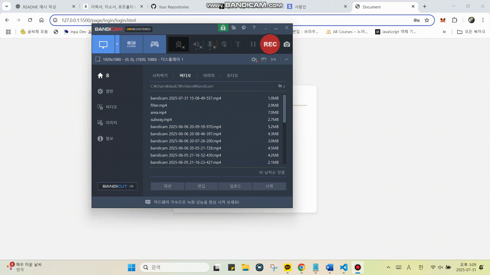
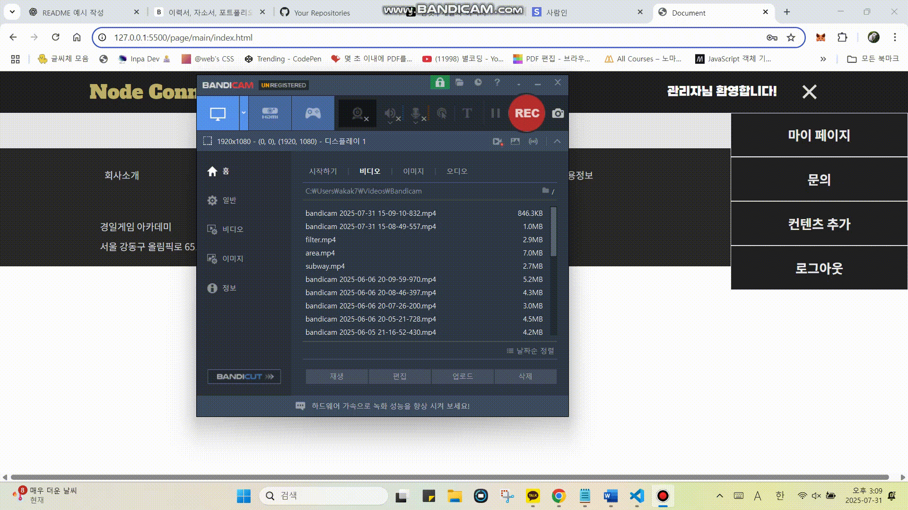

`node_connect`는 HTML, CSS, JavaScript로 구현된 영화 추천 웹 플랫폼입니다. 서버 없이 작동하며, LocalStorage와 cookie를 이용해 사용자 정보를 저장합니다. 간편한 UI를 통해 로그인, 회원가입, 마이페이지 등 기본적인 사용자 기능을 제공합니다.

---

## 배포 주소  
https://nodeconnectproject.vercel.app/

---

## 목차
- [개발 기간 및 협업 방식](#개발-기간-및-협업-방식개발)
- [주요 기능](#주요-기능)
- [화면 구성](#화면-구성)
- [담당 기능 설명](#담당-기능-설명)
- [사용 기술](#사용-기술)
- [실행 방법](#실행-방법)
- [이슈 상황](#이슈-상황)
- [개선 방향](#개선-방향)
- [향후 확장 방향](#향후-확장-방향)

---

## 개발 기간 및 협업 방식

- 개발 기간: 2025년 2월 14일 ~ 2025년 2월 21 (약 1주)
- 팀 프로젝트로 진행
- Git & GitHub를 통한 버전 관리

---

## 주요 기능

- 회원가입 및 로그인 (LocalStorage 기반)
- 로그인 유지 및 로그아웃 처리 (cookie)
- 마이페이지에서 사용자 정보 조회 및 수정
- 추천할 영화 등록 
- 서버 없이 순수 프론트엔드로 구동

## 화면 구성

### 로그인 페이지


### 회원가입 페이지


### 마이페이지 


## 담당 기능 설명

### 로그인 기능

- 사용자 입력(닉네임, 아이디 ,비밀번호)을 로컬스토리지에 저장된 데이터와 비교
- 일치하는 경우 로그인 성공 및 세션 유지
- 로그인 실패 시 경고 메시지 출력
- 로그인 후 메인 페이지로 이동

### 회원가입 기능

- 닉네임, 아이디, 비밀번호 입력
- 아이디 형식 및 필수 입력값 검증
- 유효한 경우 사용자 정보를 LocalStorage에 저장
- 회원가입 완료 시 로그인 페이지로 이동

### 마이페이지 기능
- 로그인한 사용자 정보 조회
- 사용자 정보 수정 및 회원 탈퇴

### 로그아웃 기능
- 데이터 초기화 후 로그인 페이지로 리다이렉션

## 사용 기술
- HTML5
- CSS3
- JavaScript
- LocalStorage / cookie

### 배포 링크

- https://nodeconnectproject.vercel.app/

> Vercel을 통해 정적 사이트로 배포되었으며, 브라우저에서 바로 실행 가능합니다.

---

### 실행 방법

1. 저장소 클론

```bash
git clone https://github.com/susuholee/NodeConnect_project.git
```
2. 프로젝트 파일로 이동
```bash
cd NodeConnect_project 
```
3. 브라우저에서 page/main/index.html 파일 열기
또는 VSCode의 Live Server 확장으로 실행
---
1. **아이디 중복 가입 허용**  
   - 동일한 아이디로 여러 계정 생성 가능 → 인증 오류 발생 가능성

2. **로그인 상태가 새로고침 또는 브라우저 재시작 시 유지되지 않음**  
   - 쿠키의 만료 시간 또는 인증 검증 구조 미흡

3. **비밀번호가 평문으로 저장됨**  
   - 브라우저 개발자 도구에서 누구나 열람 가능 → 보안상 취약

4. **마이페이지에서 기존 비밀번호 확인 없이 변경 가능**  
   - 로그인 상태만 유지되면 타인이 비밀번호 무단 변경 가능

5. **입력값이 동일해도 '수정 완료' 메시지 출력**  
   - 실질적인 변경 없이도 완료 메시지 발생 → 사용자 혼란

6. **로그인 실패 시 상세 오류 메시지 없음**  
   - `alert`만 출력되어 어떤 입력이 잘못되었는지 파악 어려움

7. **다중 사용자 사용 시 정보 충돌 가능성**  
   - 사용자별 데이터 분리 구조가 없어 데이터가 섞일 수 있음

---

## 개선 방향

### 1. 로그인 기능
- 비밀번호를 해시 방식으로 암호화하여 저장
- 쿠키 대신 JWT 기반 인증 체계 도입
- 로그인 실패 시 구체적인 오류 메시지 제공
- 자동 로그인 및 만료 시간 설정 기능 고도화

### 2. 회원가입 기능
- 아이디 및 닉네임 중복 여부를 실시간 검증으로 개선
- 비밀번호 확인 입력 필드 추가
- 유효성 검사 결과를 UI로 시각적 피드백 제공

### 3. 마이페이지 기능
- 비밀번호 변경 시 기존 비밀번호 확인 절차 추가
- 수정 전후 비교를 통해 실질적 변경 사항만 저장 처리
- 닉네임 변경 시 중복 확인 기능 도입

---

## 향후 확장 방향
- Node.js 기반 서버 연동 및 데이터베이스 저장 기능 추가
- 영화 API 연동을 통해 실시간 추천 콘텐츠 제공
- 반응형 웹 UI 적용으로 모바일 환경 대응
- 사용자별 즐겨찾기 데이터 서버와 동기화 기능 도입
